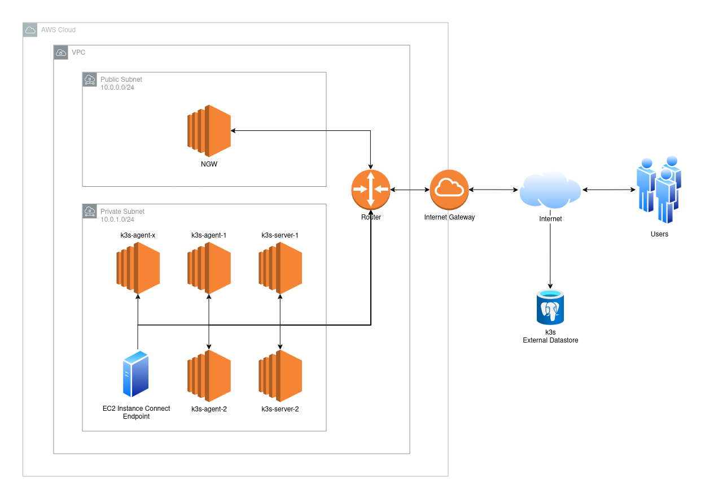

**k3sfrugal-tg** is a template designed to help you set up a k3s cluster on AWS with a focus on cost efficiency. Using OpenTofu/Terraform, Terragrunt, k3s, and AWS, this template provides a lightweight and budget-friendly Kubernetes cluster solution.

*#WIP*

# VPC

## Specification
- CIDR: 10.0.0.0/23
- AZs: Single AZ
- Public Subnet: 10.0.0.0/24
- Private Subnet: 10.0.1.0/24
- NAT Gateway: NAT Instance
- EIP: 1 Public IP Address for NAT Instance



## NAT Instance (NGW)

AWS NAT Gateway is easy to use but can be expensive due to hourly and data processing charges. A [NAT Instance](https://docs.aws.amazon.com/vpc/latest/userguide/VPC_NAT_Instance.html), which is a virtual machine, does the same job at a lower cost for low to moderate traffic levels. This template uses a NAT Instance to keep your Kubernetes cluster on AWS affordable.

## EC2 Instance Connect Endpoint

[EC2 Instance Connect Endpoint](https://docs.aws.amazon.com/AWSEC2/latest/UserGuide/connect-with-ec2-instance-connect-endpoint.html) provides a secure and straightforward way to connect to your EC2 instances via SSH without the need for Public IP addresses and managing SSH keys manually. It simplifies the SSH access process by leveraging IAM policies and AWS CLI, enhancing security and ease of use.

# K3s Cluster

# Specification

2 k3s server nodes with an external datastore using free PostgreSQL database for HA.

## Free PostgreSQL service

Recommended:
- [Neon](https://neon.tech/)

Not recommended:
- [CockroachDB](https://www.cockroachlabs.com/), free tier is slow.
- [Aiven](https://aiven.io/), got connection slots issue.
- [Supabase](https://supabase.com/), got problem when facing their connection pool.

Not tested:
- [YugabyteDB](https://www.yugabyte.com/)

# Load Balancer

NGW as a Load Balancer using HAProxy.


# Getting Started

## Requirements

- OpenTofu/Terraform
- Terragrunt
- AWS Account

Recommendation: use [tenv](https://tofuutils.github.io/tenv/) to manage OpenTofu/Terraform and Terragrunt installations.

## Start the Cluster

- Create an S3 bucket on your AWS account for the OpenTofu/Terraform state backend.
- Rename the region directory with your prefered region (`infra-live/dev-account/<region>`). Default region in this repo is `ap-southeast-3`.
- Replace the bucket name for the OpenTofu/Terraform state.
- Replace account name and account id with yours.
- Open terminal and go to the environment directory.
  ```sh
  cd infra-live/dev-account/<region>/dev
  ```
- Export PostgreSQL URL as an OpenTofu/Terraform variable.
  ```sh
  export TF_VAR_K3S_DATASTORE_ENDPOINT="<postgres-url>"
  ```
- Run terragrunt run-all plan.
  ```sh
  terragrunt run-all plan
  ```
- Review the changes that will be made by the Terragrunt.
- Run terragrunt run-all apply.
  ```sh
  terragrunt run-all apply
  ```

## Connect to the cluster

Connect to k3s server via tunnel using EC2 Instance Connect Endpoint.

## Destroy the Cluster

To destroy the entire cluster, go to the environment directory, and run
```sh
cd infra-live/dev-account/<region>/dev

terragrunt run-all destroy
```
To destroy a component, go to the one of component directory and then run destroy command
```sh
cd infra-live/dev-account/region/dev/<path>/<to>/<component>

terragrunt destroy
```
